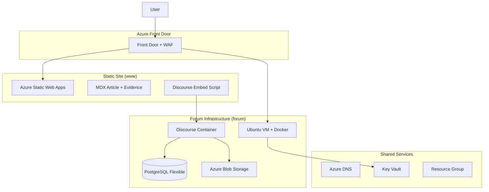
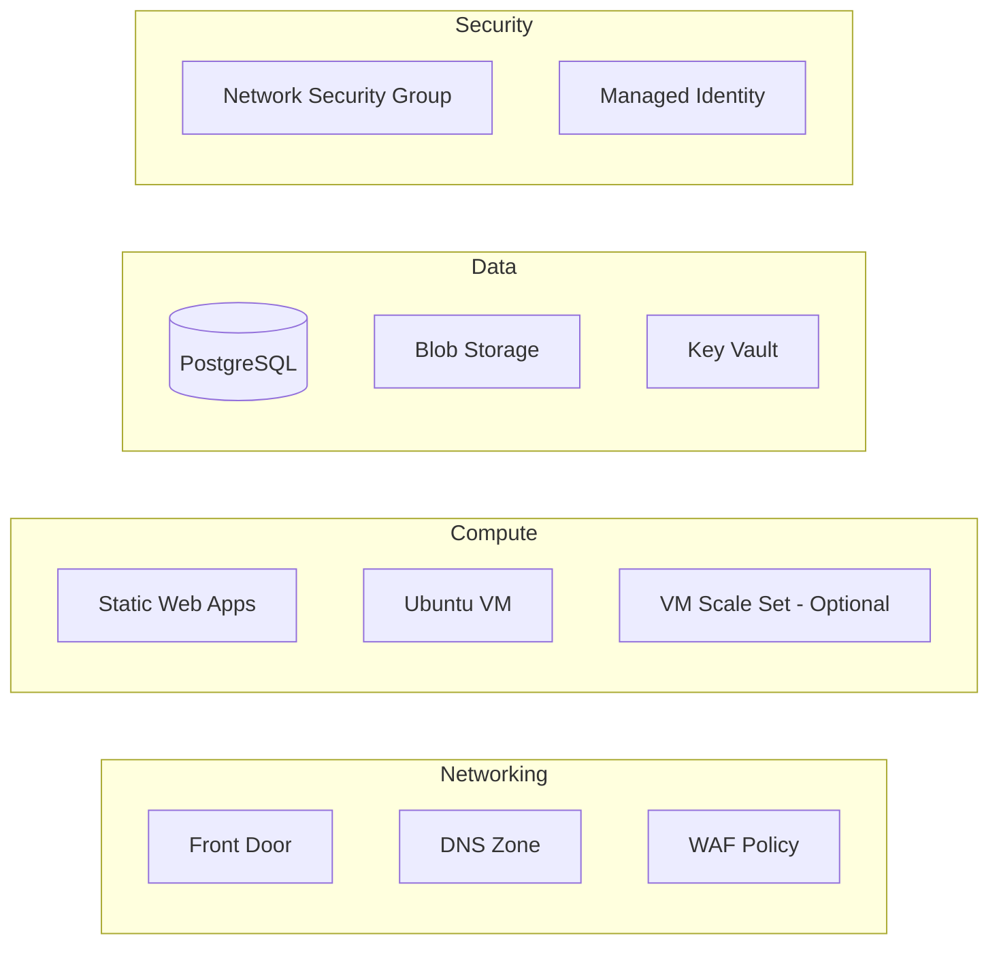

# Design Document

## Overview

RobbedByAppleCare is a production-ready monorepo that delivers a single-page article website with embedded Discourse comments, hosted on Azure infrastructure. The system consists of three main components: a Next.js 14 static site for the article content, a Dockerized Discourse forum for community engagement, and Azure infrastructure managed through Terraform for reliable hosting and security.

The architecture prioritizes performance, security, and maintainability while keeping the implementation minimal and focused on the single-purpose goal of hosting one article with community discussion.

## Architecture

### High-Level Architecture



### Technology Stack

**Frontend (Single Page)**
- Framework: Next.js 14 with App Router (static export)
- Styling: Tailwind CSS with custom design system
- Content: MDX with structured frontmatter
- Build: Static site generation for Azure Static Web Apps

**Forum**
- Platform: Discourse (latest stable via Docker)
- Database: Azure Database for PostgreSQL Flexible Server
- Storage: Azure Blob Storage (S3-compatible)
- Authentication: Google + Facebook OAuth

**Infrastructure**
- Hosting: Azure Front Door + Static Web Apps + Ubuntu VM
- IaC: Terraform for all resource provisioning
- CI/CD: GitHub Actions for automated deployments
- Security: WAF, managed certificates, security headers

## Components and Interfaces

### Web Application Component

**File Structure:**
```
apps/web/
├── app/
│   ├── layout.tsx          # Root layout with security headers
│   ├── page.tsx            # Main article page
│   ├── globals.css         # Tailwind + custom styles
│   └── opengraph-image.tsx # Dynamic OG image generation
├── components/
│   ├── Article.tsx         # MDX article renderer
│   ├── EvidenceGallery.tsx # Lightbox gallery component
│   ├── DiscourseEmbed.tsx  # Embedded comments component
│   └── ui/                 # Design system components
├── content/
│   └── article.mdx         # Main article content
├── public/
│   ├── evidence/           # Optimized evidence images
│   ├── sitemap.xml
│   └── robots.txt
└── scripts/
    └── process-evidence.js # Image optimization script
```

**Key Interfaces:**

```typescript
// Article frontmatter interface
interface ArticleFrontmatter {
  title: string;
  subtitle: string;
  authorDisplay: string;
  publishedAt: string;
  tldr: string;
  tags: string[];
  heroImage: string;
  ogImage: string;
  canonicalUrl: string;
  evidence: EvidenceItem[];
}

interface EvidenceItem {
  src: string;
  type: 'image' | 'pdf';
  caption: string;
  alt?: string;
}

// Security headers configuration
interface SecurityHeaders {
  'Content-Security-Policy': string;
  'Strict-Transport-Security': string;
  'X-Frame-Options': string;
  'X-Content-Type-Options': string;
  'Referrer-Policy': string;
  'Permissions-Policy': string;
}
```

### Discourse Integration Component

**Embedded Comments Implementation:**
```javascript
// Discourse embed configuration
const DiscourseEmbed = {
  discourseUrl: 'https://forum.robbedbyapplecare.com/',
  discourseEmbedUrl: document.querySelector('link[rel="canonical"]')?.href || window.location.href,
  discourseUserName: 'system', // Auto-topic creation user
  discourseTopicId: null // Auto-generated on first visit
};
```

**Discourse Configuration:**
- Enable embedded topics in admin settings
- Whitelist www.robbedbyapplecare.com for embeds
- Configure default category for embedded topics
- Set up CORS headers for cross-origin requests
- OAuth providers: Google (built-in) + Facebook (plugin)

### Infrastructure Component

**Azure Resources Architecture:**



**Terraform Module Structure:**
```
infra/terraform/
├── main.tf                 # Root module
├── variables.tf            # Input variables
├── outputs.tf              # Resource outputs
├── modules/
│   ├── networking/         # Front Door, DNS, WAF
│   ├── static-site/        # Static Web Apps
│   ├── discourse/          # VM, PostgreSQL, Blob
│   └── security/           # Key Vault, NSG, headers
└── environments/
    ├── dev.tfvars
    └── prod.tfvars
```

## Data Models

### Article Content Model

```typescript
interface Article {
  frontmatter: ArticleFrontmatter;
  content: string; // MDX content
  evidence: ProcessedEvidence[];
  metadata: {
    wordCount: number;
    readingTime: number;
    lastModified: string;
  };
}

interface ProcessedEvidence {
  original: string;
  webp: {
    '320': string;
    '640': string;
    '1280': string;
  };
  dimensions: {
    width: number;
    height: number;
  };
  fileSize: number;
  caption: string;
  type: 'image' | 'pdf';
}
```

### Discourse Data Integration

```yaml
# Discourse app.yml configuration
discourse:
  database:
    host: ${POSTGRES_HOST}
    name: discourse_production
    username: discourse_user
    password: ${POSTGRES_PASSWORD}
  
  storage:
    provider: s3
    endpoint: https://${STORAGE_ACCOUNT}.blob.core.windows.net
    bucket: discourse-uploads
    access_key_id: ${BLOB_ACCESS_KEY}
    secret_access_key: ${BLOB_SECRET_KEY}
  
  oauth:
    google:
      client_id: ${GOOGLE_CLIENT_ID}
      client_secret: ${GOOGLE_CLIENT_SECRET}
    facebook:
      app_id: ${FACEBOOK_APP_ID}
      app_secret: ${FACEBOOK_APP_SECRET}
```

## Error Handling

### Frontend Error Handling

```typescript
// Error boundary for React components
class ArticleErrorBoundary extends React.Component {
  handleDiscourseLoadError() {
    // Fallback: show "Comments unavailable" message
    // Retry mechanism with exponential backoff
  }
  
  handleImageLoadError() {
    // Fallback: show placeholder or skip image
    // Log error for monitoring
  }
  
  handleMDXParseError() {
    // Fallback: render raw content or error message
    // Alert development team
  }
}
```

### Infrastructure Error Handling

**VM Health Monitoring:**
```bash
# Health check script
#!/bin/bash
if ! docker ps | grep -q discourse; then
  systemctl restart discourse
  curl -f http://localhost/health || exit 1
fi
```

**Database Connection Resilience:**
- Connection pooling with retry logic
- Automatic failover configuration
- Backup restoration procedures

**Front Door Error Pages:**
- Custom 404/500 error pages
- Graceful degradation for maintenance
- Health probe configurations

## Testing Strategy

### Frontend Testing

**Unit Tests:**
```typescript
// Component testing with Jest + Testing Library
describe('EvidenceGallery', () => {
  test('renders images with proper alt text', () => {
    // Test accessibility compliance
  });
  
  test('opens lightbox on image click', () => {
    // Test interaction behavior
  });
  
  test('handles missing images gracefully', () => {
    // Test error scenarios
  });
});
```

**Integration Tests:**
```typescript
// Discourse embed integration
describe('DiscourseEmbed', () => {
  test('creates topic on first page load', async () => {
    // Mock Discourse API responses
    // Verify topic creation
  });
  
  test('loads existing topic on subsequent visits', async () => {
    // Test caching and persistence
  });
});
```

**Performance Tests:**
- Lighthouse CI in GitHub Actions
- Core Web Vitals monitoring
- Image optimization verification
- Bundle size analysis

### Infrastructure Testing

**Terraform Validation:**
```bash
# CI pipeline tests
terraform fmt -check
terraform validate
terraform plan -detailed-exitcode
```

**Security Testing:**
```bash
# Security header validation
curl -I https://www.robbedbyapplecare.com | grep -E "(CSP|HSTS|X-Frame)"

# SSL/TLS configuration test
testssl.sh --quiet https://www.robbedbyapplecare.com
```

**Discourse Testing:**
```bash
# Health check automation
curl -f https://forum.robbedbyapplecare.com/srv/status
docker exec discourse_app discourse version
```

### End-to-End Testing

**User Journey Tests:**
1. Page load performance and content rendering
2. Evidence gallery interaction and lightbox
3. Discourse embed loading and topic creation
4. OAuth login flow (Google/Facebook)
5. Comment posting and display
6. Mobile responsiveness and accessibility

**Automated Testing Pipeline:**
```yaml
# GitHub Actions workflow
- name: E2E Tests
  run: |
    npm run test:e2e
    npm run test:accessibility
    npm run test:performance
```

## Security Considerations

### Content Security Policy

```javascript
const csp = {
  'default-src': "'self'",
  'img-src': "'self' data: https://*.blob.core.windows.net",
  'script-src': "'self' 'unsafe-inline' https://forum.robbedbyapplecare.com",
  'style-src': "'self' 'unsafe-inline'",
  'connect-src': "'self' https://forum.robbedbyapplecare.com",
  'frame-ancestors': "'none'",
  'base-uri': "'self'",
  'form-action': "'self'"
};
```

### Infrastructure Security

**Network Security:**
- NSG rules limiting VM access to necessary ports
- VNet integration for database access
- Private endpoints for storage accounts

**Identity and Access:**
- Managed Identity for VM-to-Azure service authentication
- Key Vault for secret management
- Principle of least privilege for all service accounts

**Data Protection:**
- Encryption at rest for PostgreSQL and Blob Storage
- TLS 1.2+ enforcement for all connections
- Regular security updates via automated patching

This design provides a comprehensive foundation for implementing the RobbedByAppleCare project with proper separation of concerns, security best practices, and maintainable architecture patterns.